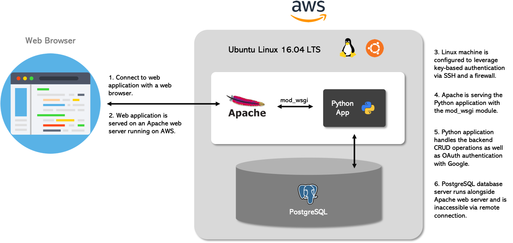

# Linux Server Configuration

This repository will guide you through how to take a baseline installation of an Ubuntu Linux Virtual Machine using Amazon Lightsail and prepare it to host web applications. It will include installing updates, securing it from attacks and installing/configuring web and database servers. Finally, it will show you how to deploy my previously built item catalog application.

***

## Design

The architecture for this web application consists of a Python Flask application being served via mod_wsgi on an Apache web server. This Apache web server is being hosted on an AWS Lightsail Ubuntu Linux 16.04 LTS machine, and is accessing data from a PostgreSQL database on the same instance. The front end has been built using HTML, CSS, JavaScript, jQuery and AJAX.

 
 

    

 
 

***

## Setup

### 1. Starting Ubuntu Linux VM

For this project I used a baseline installation of an Ubuntu Linux Virtual Machine provided by [Amazon Lightsail](https://lightsail.aws.amazon.com/ls/webapp/home/instances).

- First, log in to Lightsail.
- Once you're logged in, you'll be prompted to create an instance. Choose a plain Ubuntu Linux image and select the option for "OS Only".

> **Note**: I used a Ubuntu Linux 16.04 LTS instance for my setup.

- Under the header `SSH key pair manager`, you can select, create or upload the key pair that you'd like to use to SSH into the instance.

> For this, we will step away from the Lightsail window, and open a fresh terminal window on your local computer. We will use the `ssh-keygen` application to generate our public/private key pair.

    $ ssh-keygen
    # Now you will be asked to enter the file in which to save the key. The directory suggested is the default directory, I recommend staying with this. However choose a memorable name so you know this key pair is for this instance. I chose the below filename:
    $ /Users/arun/.ssh/item_catalog
    # It then prompts you to enter a password, for this project you can leave this as blank, but feel free to enter one if you wish.

- Now we have created our key pair, we want to upload this into the `SSH key pair manager` within Lightsail. Switch back to your Lightsail setup browser window and click on `Change SSH key pair` button under the "OPTIONAL" header.
- Choose "Upload New", and browse your file system to find the key pair you just created. Select the key which ends in `.pub`, this is the public key that we need to place on the server to enable key based authentication.
- Next, you'll be asked to choose an instance plan. This determines how powerful of a server you get and how much you'll be charged for its usage. For this project I chose the lowest tier, which is free for 30 days.
- Every instance requires a unique hostname. For this project, I named my instance `item-catalog`, but you can name yours anything you wish.
- Click on Create and wait for the instance for start up. This may take a few minutes.
- Once it has started, you can log into it using SSH by clicking on the button `Connect via SSH`.
- Provided this has all worked, you will now be logged into your machine via SSH as the `ubuntu` user, within a window in your browser.

### 2. Secure Server

#### Update package source list and currently installed packages

An easy step to ensure your server is secure is to keep your software up to date with nerw releases. The first step to update your installed software is to update your package source list. This makes sure your system is aware of the latest information stored within the repositories you're making use of.

    $ sudo apt-get update

Now that our system is aware of all the software available and their most recent version, let's upgrade this software.

    $ sudo apt-get upgrade

Finally, let's remove any unneeded packages.

    $ sudo apt-get autoremove

#### SSH configuration

The default SSH port is `22`. We want to change this port to `2200`. To do this, edit the `sshd_config` file to allow SSH requests from port `2200` with the following command.

    $ sudo nano /etc/ssh/sshd_config

Once you see the contents of this file with the `nano` application, change line 5 that says `Port 20` to `Port 2200`. Whilst we are in this file, let's also disable login as the `root` user, to ensure security of the instance.

Scroll down to the line starting with `PermitRootLogin`, and make sure that it says `no` after this word. Then save and exit this file by typing `CTRL+X`, `Y`, `Enter`, one after another.

#### Firewall configuration

Using the **Uncomplicated Firewall** (UFW) application, we will configure the firewall for this server to only allow incoming connections for **SSH** (port 2200), **HTTP** (port 80) and **NTP** (port 123). First, block all incoming requests.

    $ sudo ufw default deny incoming

Allow all outgoing requests.

    $ sudo ufw default allow outgoing

Allow SSH on port 2200.

    $ sudo ufw allow 2200/tcp

Allow HTTP on port 80.

    $ sudo ufw allow www

Allow NTP port 123.

    $ sudo ufw allow 123/tcp

Finally, start the firewall.

> **Warning**: When changing the SSH port, make sure that the firewall is open for port 2200 first, otherwise you will be locked out of the server. When you change the SSH port, the instance will no longer be accessible through the web app `Connect using SSH` button. Instructions on how to connect through a temrinal window are provided later.

    $ sudo ufw enable

### 3. Create 'grader' User

Whilst still logged in via SSH within your browser, we need to create a new user called `grader`.

    $ sudo adduser grader

Enter a password, but we will disable this later. You can hit enter when prompted to fill in more information, or feel free to fill in the details (Full name, Room number, Work phone, Home phone, Other). Next we need to make `grader` a sudoer. To do this, we can copy the existing `sudoers.d` file as `grader`.

    $ sudo cp /etc/sudoers.d/90-cloud-init-users /etc/sudoers.d/grader

Now give read and write permissions to root for this user.

    $ sudo chmod 600 /etc/sudoers.d/grader

The final thing is to edit the `grader` file in sudoers.d, all that needs to be changed is `ubuntu ALL=(ALL) NOPASSWD:ALL` to `grader ALL=(ALL) NOPASSWD:ALL`.

    $ sudo nano /etc/sudoers.d/grader

### 4. Public/Private Key

You should be still logged in as `ubuntu` within the instance. Now that we have created another user `grader`, let's switch user to `grader`.

    $ su - grader

In the root directory, create a directory called `.ssh`.

    $ sudo mkdir /.ssh

Within the `.ssh` folder, create a file called `authorized_keys`.

    $ sudo touch /.ssh/authorized_keys

Keep this window open where you're logged into the instance via SSH in the browser, but return to the public key that we generated earlier on your local machine. We can do this by opening a terminal window and running

    $ cat ~/.ssh/item_catalog.pub

View the contents and copy this entire key into the `authorized_key` file within the VM using:

    $ sudo nano /.ssh/authorized_keys

Next, we need to set up some specific file permissions on the `authorized_keys` file and the `.ssh` directory. This is a security measure that ssh enforces to ensure other users cannot gain access to your account. From within your instance, run the following commands

    $ sudo chmod 700 /.ssh
    $ sudo chmod 644 /.ssh/authorized_keys

Now let's log out of the grader user.

    $ exit

And log out of the instance. Return to the your Lightsail instance screen within your browser. Navigate to the `Networking` tab and you should see under `Firewall`, that the instance accepts connections on port `22` and `80` for SSH and HTTP respectively. We need to add 2 more connections and remove the **SSH** connection on port 22. Click on `Edit rules`, delete the connection on port `22` and add two connections with the following settings. Finally save these changes.

    Application: Custom
    Protocol: TCP
    Port range: 2200

    Application: Custom
    Protocol: TCP
    Port range: 123

Finally, reboot the instance by clicking on `Reboot` and from a terminal window, ssh into the instance with your new user and private key using this command:

    $ ssh grader@35.178.22.227 -i ~/.ssh/item_catalog -p 2200

### 5. Disable Password Authentication

After re-entering your instance via SSH from a terminal window, we now need to disable password authentication so that users have to authenticate using key-based authentication. To do this ppen the SSH daemon configuration file.

    $ sudo nano /etc/ssh/sshd_config

Scroll down to the line starting with `PasswordAuthentication`. Ensure that after this word, it says `no`. Then save and close the file using `CTRL+X`, `Y`, `Enter`. Reload the ssh daemon to refresh these changes.

    $ sudo systemctl reload sshd

***

## Deploy Application

### 1. Change Timezone

Configure the local timezone to UTC.

    $ sudo dpkg-reconfigure tzdata

Scroll down to `None of the above` and hit enter. Then scroll down again and hit enter when you find `UTC`.

### 2. Install Apache2 webserver and mod_wsgi

Apache is by far the most popular web server available, with 47% market share. We will now install an Apache2 webserver to serve a Python mod_wsgi application. Ensure that you are logged in as the `grader` user and run the following commands.

    $ sudo apt-get install apache2
    $ sudo apt-get install libapache2-mod-wsgi

> Check to see if the Apache web server is running by visiting `35.178.22.227:80`. You should be presented with an Apache documentation site. If so, this means that Apache has been properly installed.

### 3. Install Git

Ensure that you are still logged in as the `grader` user and run this command.

    $ sudo apt-get install git

Next we can configure our username and email for the Git account that we will be using.

    $ git config --global user.name <username>
    $ git config --global user.email <email>

### 4. Clone Application from GitHub

Since I cloned my own item catalog project into the instance, I will be referring to this [repository](https://github.com/agodwinp/item-catalog). By default, Apache starts up a web server and serves the files located in `/var/www/html/`. In the following steps we will clone my web application and configure Apache to hand-off certain requests to an application handler called `mod_wsgi`. First, we need to navigate to `/var/www`.

    $ cd /var/www

Then make a new directory for the git repository.

    $ sudo mkdir catalog

Change ownership of this directory to be owned by `grader`.

    $ sudo chown grader catalog

Move inside the newly created folder and clone the repository from Github into a folder called `catalog`.

    $ cd catalog
    $ git clone https://github.com/agodwinp/item-catalog.git catalog

`cd` into the repository and checkout the deployment branch.

    $ cd catalog
    $ git checkout deployment

> **Note**: We are checking out of the master branch and into a new branch called `deployment`. I created this seperate branch which differes slightly from the master branch to ensure that the application deploys properly with the new tools being used.

Make a `catalog.wsgi` file to serve the application over `mod_wsgi`, and then edit this file with nano.

    $ touch catalog.wsgi
    $ nano catalog.wsgi

Include the following code within this file.

    import sys
    import logging
    logging.basicConfig(stream=sys.stderr)
    sys.path.insert(0, "/var/www/catalog/")

    from catalog import app as application

Save and exit from this file with `CTRL+X`, `Y` and `Enter`.

> **Note**: the .git folder will be inaccessible from the web without any particular setting. The only directory that can be listed in the browser will be the `static` folder.

### 5. Install Virtual Environment & project dependencies

In order to isolate the applications dependencies away from the main server, we will be creating a Python Virtual Environment to house the application, files and dependencies. First of all install pip, the tool for installing Python packages and update it.

    $ sudo apt-get install python-pip
    $ sudo pip install --upgrade pip

If `virtualenv` is not installed, use pip to install it using the following command.

    $ sudo pip install virtualenv

Move to the parent `catalog` folder and then create a new virtual environment.

    $ cd /var/www/catalog
    $ sudo virtualenv venv

Activate the virtual environment so that we are now working within it.

    $ source venv/bin/activate

Change permissions to the virtual environment folder so that all users can read, write and execute files from it.

    $ sudo chmod -R 777 venv

Install all the projects dependencies using the `requirements.txt` file.

    $ sudo pip install -r catalog/requirements.txt

Install `psycopg2`.

    $ sudo pip install psycopg2-binary
    $ deactivate

The final `deactivate` command will bring you out of the virtual environment.

### 6. Configure new Virtual Host

Before, Apache was serving the files residing in the `var/www/html` directory. Now we will configure Apache to serve the cloned application. First we must create a virtual host configuration file.

    $ sudo nano /etc/apache2/sites-available/catalog.conf

Include the following lines of code in this file.

    <VirtualHost *:80>
        ServerName 35.178.22.227
        ServerAlias ec2-35-178-22-227.eu-west-2.compute.amazonaws.com
        ServerAdmin admin@35.178.22.227
        WSGIDaemonProcess catalog python-path=/var/www/catalog:/var/www/catalog/venv/lib/python2.7/site-packages
        WSGIProcessGroup catalog
        WSGIScriptAlias / /var/www/catalog/catalog/catalog.wsgi
        <Directory /var/www/catalog/catalog/>
            Order allow,deny
            Allow from all
        </Directory>
        Alias /static /var/www/catalog/catalog/static
        <Directory /var/www/catalog/catalog/static/>
            Order allow,deny
            Allow from all
        </Directory>
        ErrorLog ${APACHE_LOG_DIR}/error.log
        LogLevel warn
        CustomLog ${APACHE_LOG_DIR}/access.log combined
    </VirtualHost>

> The **WSGIDaemonProcess** line specifies to use the virtual environment and its packages to run the application.

Now, enable the new virtual host.

    $ sudo a2ensite catalog

Finally, to activate the new configuration reload the Apache server.

    $ sudo service apache2 reload

### 7. Install and Configure PostgreSQL

For this application, we are running both the Apache web server and the database server on the same machine. The database of choice is [PostgreSQL](https://www.postgresql.org).

First we need to install some necessary Python packages for working with PostgreSQL.

    $ sudo apt-get install libpq-dev python-dev

Then, we need to install PostgreSQL.

    $ sudo apt-get install postgresql postgresql-contrib

Postgres automatically creates a new user during its installation, whose name is `postgres`. This user is a trusted user that can access the software installed. Now let's change to this automatically created user `postgres` and connect to the database system.

    $ sudo su - postgres
    $ psql

Now let's create a new user called `catalog` with password = `password`.

    # CREATE USER catalog WITH PASSWORD 'password';

Give the `catalog` user the `CREATEDB` capability.

    # ALTER USER catalog CREATEDB;

Create a `catalog` database owned by `catalog` user.

    # CREATE DATABASE catalog WITH OWNER catalog;

Now, connect to the `catalog` database.

    # \c catalog

Revoke all rights from the `catalog` database.
        
    # REVOKE ALL ON SCHEMA public FROM public;

And now lock down the permissions to only let the `catalog` user create tables.

    # GRANT ALL ON SCHEMA public TO catalog;

Finally, log out from PostgreSQL and return to the `grader` user on the server.

    # \q
    $ exit

Within the files cloned from GitHub, we have a file called `populatedb.py` which will populate our database when run. To do this, set up the database with the following command.

    $ python /var/www/catalog/catalog/populatedb.py

To prevent potential attacks we need to ensure that no remote connections are allowed to the database. To do this, open the file `ph_hba.conf` and edit it to include the lines shown below.

    $ sudo nano /etc/postgresql/9.3/main/pg_hba.conf

    local   all             postgres                                peer
    local   all             all                                     peer
    host    all             all             127.0.0.1/32            md5
    host    all             all             ::1/128                 md5

### 7. Update OAuth Authorised Javascript Origins and Domains

To let users correctly log in with Google Sign-In you must add http://ec2-35-178-22-227.eu-west-2.compute.amazonaws.com to the list of authorized URI's for this Client ID.

You can do this from the [Google Developers Console](https://console.developers.google.com/apis/dashboard?project=excellerate).

### 8. Restart Apache

Now that we have cloned our application, configured Apache to serve the application using mod_wsgi, set up the database for our application to create, read, update and delete data from and secured our server from attacks... we are ready to go! 

All that is left to do, is restart Apache and our application will be automatically served.

    $ sudo service apache2 restart

> If at any point the web server does not serve the item catalog application any longer, you can view the Apache error log by running the following command on thr server

    $ sudo cat /var/log/apache2/error.log

***

## Usage

- IP Address: 35.178.22.227
- Accessible SSH Port: 2200
- Application URL: http://ec2-35-178-22-227.eu-west-2.compute.amazonaws.com

To access my **Item Catalog** application, visit the application URL above!

***

## Authors

Arun Godwin Patel
